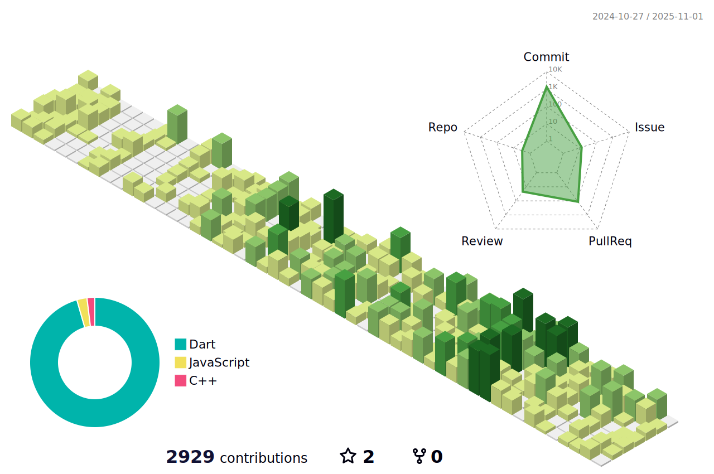

# Ituking
👦 I am an infrastructure engineer who builds software as a hobby.  
🧑‍💻 My main learnings are Flutter, Firebase, and modern DevOps practices.  
🚀 Current Projects: Working on a Flutter app integrating Google Maps and Firebase for location-based services.  
🎮 Hobbies: Gaming, Blogging, and Exploring cutting-edge technologies.  
📮 How to Reach me: Blog [itsuking.net](https://itsuking.net) or Twitter [@Jedda67019847](https://twitter.com/Jedda67019847)  

## GitHub Stats
  

## Skills
- **Languages:** Dart, JavaScript, Python  
- **Frameworks:** Flutter, React  
- **Cloud Services:** Firebase, AWS  
- **DevOps Tools:** Docker, Kubernetes, Terraform  

## Highlights
- 🌟 Contributor to open-source projects related to Flutter.
- 🏆 Featured blog posts on [itsuking.net](https://itsuking.net).
- 🎉 Over 100+ GitHub contributions this year!

